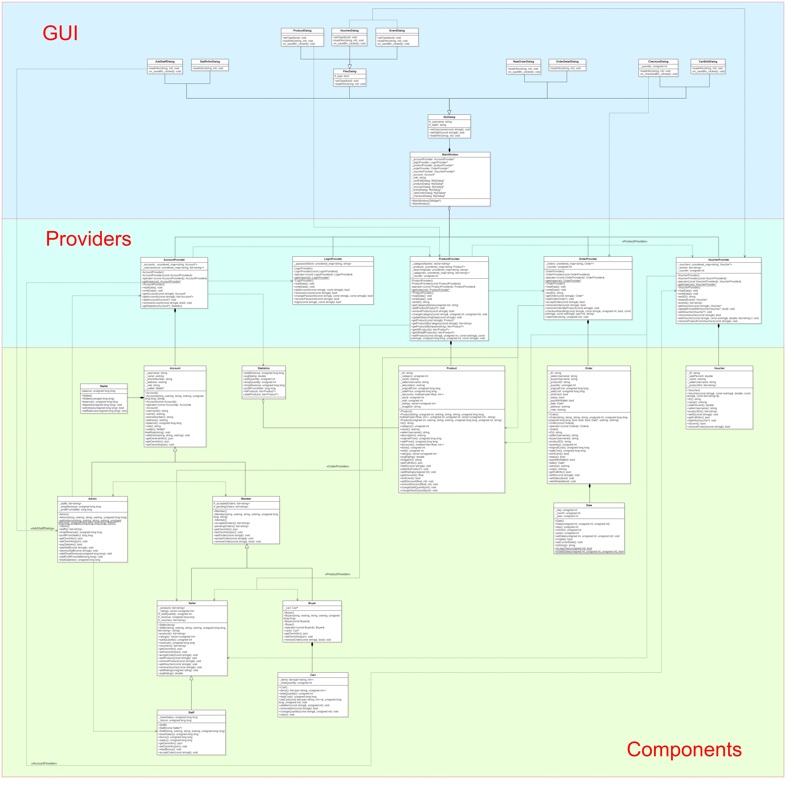
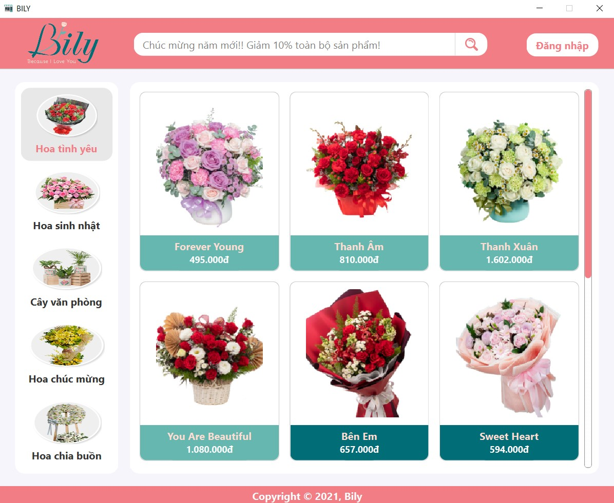
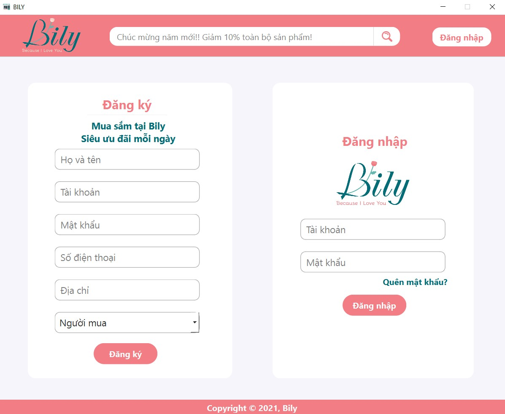
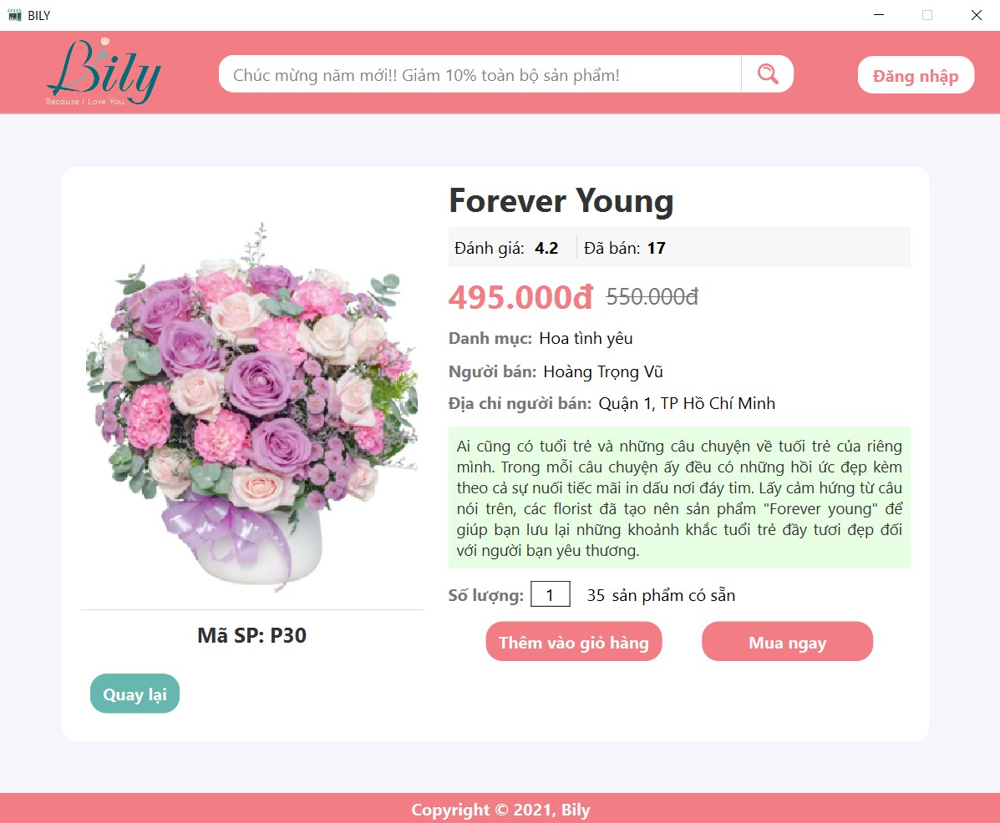
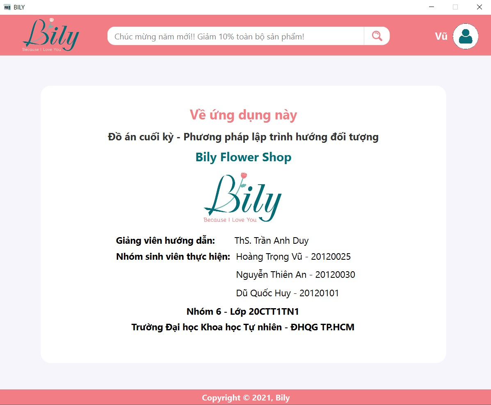

<h1 style="text-align: center;">Bily Flower Shop</h1>

This is our final project for OOP course.

Content:
<ul>
    <li><a href="#try-our-app">Try our app</a></li>
    <li><a href="#build-code">Build the source codes</a></li>
    <li><a href="#demo">Demo</a></li>
    <li><a href="#about-us">About us</a></li>
</ul>

<h3 id="try-our-app">Try our app</h3>
You can download the app from <a href="https://studenthcmusedu-my.sharepoint.com/:u:/g/personal/20120025_student_hcmus_edu_vn/Ed6EqE7mtXFLhljTgn-_KU4Brhra5ZSYd9eGoix6X1aWCQ?e=l64Qtw">this link</a>, or clone this repository and the app is available in folder Release.

<h3 id="build-code">Build the source codes</h3>

To build this source codes, you should use IDE Qt Creator and do the following steps: 
<ul>
<li>Change the directory to database in file CONSTANTS.h from "Database/..." to "../Database/..."</li>
<li>Create folder Release inside folder Source</li>
<li>Open project from file BILY.pro in folder Source/GUI</li>
<li>Set the output folder of project to folder Release</li>
<li>Build project with Ctrl + R</li>
</ul>

<h3 id="class-diagram"> Class Diagram </h3>
We apply Singleton pattern in implementations of Providers and class Admin.
</img>
   
<h3 id="demo">Demo</h3>

Home page

</img> 

Login page

</img>

Product page

</img>

Account page

</img>

<h3 id="about-us">About Us</h3>
</img>

